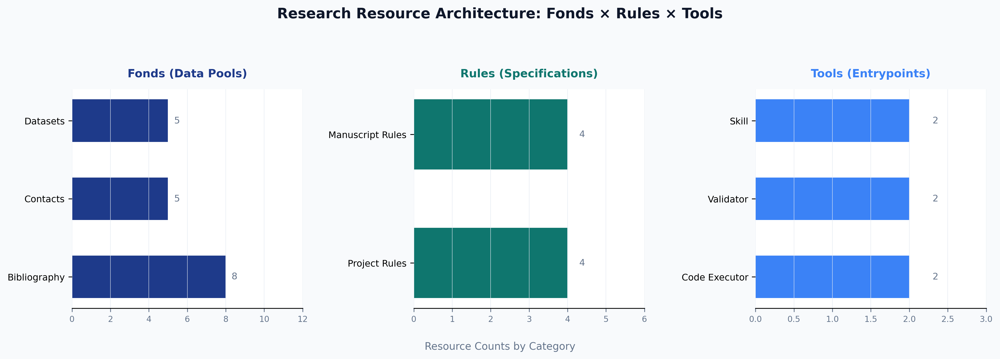

# Introduction

## Motivation

Modern research software repositories increasingly adopt monorepo designs in which multiple projects share a common set of curated resources. A monorepo consolidates source code, documentation, datasets, and governance artefacts under one version-controlled root, enabling atomic cross-project changes and a single source of truth for shared data [@Fowler2002patterns]. The practical benefit is significant: a bibliography updated once in `fonds/templates/template_bibliography/` is immediately available to every project that discovers it at runtime, without any per-project copy.

Three categories of shared resource appear consistently across research template repositories:

1. **Data pools (fonds)**: curated reference sets — bibliographies, contact registries, dataset catalogues — that projects query but must never mutate.
2. **Governance rules**: machine-readable constraint schemas and human-readable style guidelines that projects load to validate their own outputs.
3. **Executable tools**: script-based entry points that projects invoke to run computations, validate artefacts, or call external agents.

Without a canonical integration pattern for consuming these resources, projects face a dilemma: they can hard-code discovery paths (creating fragile, repo-root-sensitive logic) or skip resource consumption entirely (forfeiting the monorepo's collaborative benefits). Neither outcome is acceptable in a public, forkable template repository intended to demonstrate best practices [@Wilson2014best].

## Contribution

This paper introduces `template_pools_rules_tools`, a **meta-project exemplar** that resolves this dilemma with a four-module architecture (@fig:architecture). Each module handles one resource category plus a fourth orchestration module:

| Module | Resource category | Key function |
|---|---|---|
| `src/fonds_reader.py` | Data pools | `read_all_fonds()` |
| `src/rules_applier.py` | Governance rules | `validate_against_rules()` |
| `src/tools_invoker.py` | Executable tools | `discover_tools()` |
| `src/integration.py` | All three | `run_integration_demo()` |

{#fig:architecture width=90%}

The architecture obeys three design invariants:

- **Read-only resource access**: no module writes to `fonds/`, `rules/`, or `tools/`. The Layer Contract in `AGENTS.md` enforces this at code-review time.
- **Repo-root-relative discovery**: all path resolution uses `pathlib.Path(__file__).resolve().parents[N]` so that scripts work from any working directory.
- **Graceful degradation**: every reader checks file existence before parsing and catches `yaml.YAMLError` around the parse itself, logging a warning and returning a safe empty value either way. The pipeline never raises on a missing or malformed resource.

## Related Work and Alternative Designs

Three broad alternatives to the fonds/rules/tools pattern are common in research-software monorepos, and each has a known failure mode this design deliberately avoids.

**Shared library packages.** A monorepo could publish its bibliography, contacts, and datasets as an installable Python package (`pip install monorepo-shared-data`) rather than a filesystem convention. This works well for stable, versioned data but reintroduces a packaging and release cycle for data that changes far more often than code — every bibliography update would require a version bump and a re-install across every consuming project, which is precisely the coordination overhead a monorepo is meant to eliminate.

**Symlink-based sharing.** Projects could symlink directly into a shared resource directory rather than discovering it at runtime through a reader module. This avoids the reader module's implementation cost but loses the schema-validation and graceful-degradation layers: a symlinked file that is malformed YAML fails wherever it is read, with no structured `status` the pipeline can act on, and no compatibility check against the manifest's `version` field.

**Environment-variable configuration.** Resource locations could be injected via environment variables (`FONDS_ROOT`, `RULES_ROOT`) rather than resolved relative to the repository root. This is the standard twelve-factor-app pattern for services, but it is a poor fit for a forkable template repository: a contributor who clones the repository and runs a script expects it to work without any environment setup, and environment variables are precisely the kind of implicit, undocumented dependency that a public exemplar should not require.

The manifest-and-reader pattern adopted here — versioned typed manifests, repo-root-relative discovery, and graceful degradation — sits between these alternatives: no packaging overhead, structured validation, and zero required environment configuration. @fig:pipelineflow shows how this pattern integrates into the project's script pipeline end-to-end.

## Paper Organisation

The remainder of this paper is structured as follows. @sec:pools describes the fond layer and the `fonds_reader` module, including the fond schema taxonomy (@fig:taxonomy). @sec:rules describes the rules layer and the `rules_applier` module, including the soft/strong rule hierarchy (@fig:rulehier). @sec:tools describes the tool layer and the `tools_invoker` module, including the tool invocation contract (@fig:toolcontract). @sec:integration presents the unified integration pipeline, the manuscript variable token system, the three-level resilience design (@fig:resilience), and the script pipeline (@fig:pipelineflow). @sec:conclusion summarises key findings, limitations, and future directions.

The architecture overview in @fig:architecture provides a visual map of these relationships. Runtime statistics collected during integration are visualised in @fig:counts, and the corresponding per-component pass/partial/missing states are shown in @fig:pipeline.
