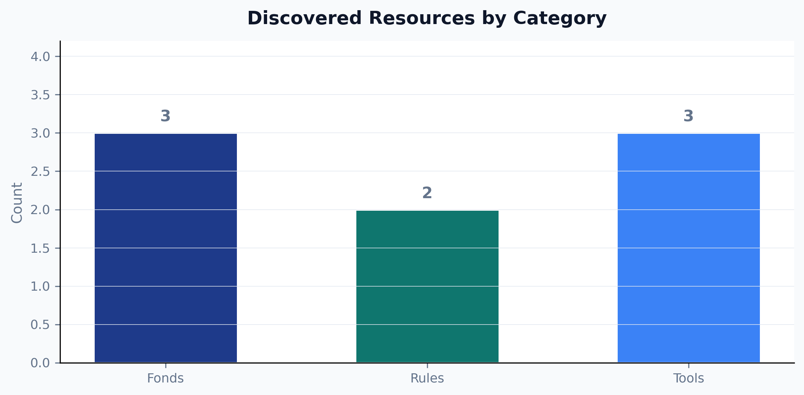
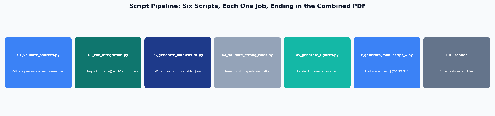
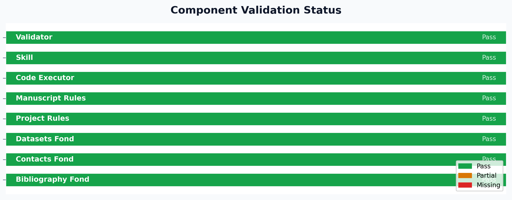
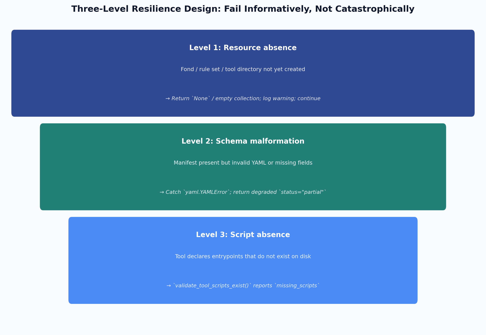

# Integration: Unified Pipeline and Token Injection {#sec:integration}

## Architecture Overview

The three resource layers described in @sec:pools, @sec:rules, and @sec:tools are orchestrated by a single function in `src/integration.py`. The `run_integration_demo()` function calls all three subsystems in a defined order, collects their results into a structured dictionary, and writes summary counts to `output/data/manuscript_variables.json` for injection into this manuscript at render time. @fig:architecture illustrates the complete architecture.

```
run_integration_demo()
  ├── read_bibliography_fond()       → {"manifest": ..., "bibtex": ..., "csv_rows": [...]}
  ├── read_contacts_fond()           → {"manifest": ..., "contacts": [...]}
  ├── read_datasets_fond()           → {"manifest": ..., "datasets": [...]}
  ├── validate_against_rules("template_project_rules")    → {"status": "ok", ...}
  ├── validate_against_rules("template_manuscript_rules") → {"status": "ok", ...}
  ├── discover_tools()               → [{"name": ..., "manifest": ...}, ...]
  └── validate_tool_scripts_exist(<each tool>)            → {"status": "ok", ...}
```

The function returns a top-level dict with keys `fonds`, `rules`, `tools`, and `summary`. The `summary` sub-dict provides the counts that populate manuscript tokens.

## Manuscript Variable Tokens

The token injection system bridges the integration pipeline and the manuscript prose. Tokens use double-brace syntax: `{{FONDS_LOADED}}` expands to the integer count of fonds successfully loaded during the most recent integration run. Tokens are resolved by `scripts/03_generate_manuscript.py`, which reads `output/data/manuscript_variables.json` and substitutes each token before the manuscript is passed to the rendering engine.

{#fig:counts width=75%}

The current `manuscript_variables.json` contains the following summary values (see @fig:counts for a visual representation):

| Token | Value |
|---|---|
| `{{FONDS_LOADED}}` | {{FONDS_LOADED}} |
| `{{RULES_SETS_OK}}` | {{RULES_SETS_OK}} |
| `{{TOOLS_DISCOVERED}}` | {{TOOLS_DISCOVERED}} |
| `{{BIB_ENTRIES}}` | {{BIB_ENTRIES}} |

This table is itself token-injected: the values shown are those produced by the pipeline, not hard-coded by the manuscript author. If the pipeline results change — for example, because a new fond is added — re-running `scripts/03_generate_manuscript.py` updates the manuscript automatically, without manual editing. This property is central to reproducibility: the manuscript's quantitative claims are always consistent with the code that generated them [@Stodden2016enhancing].

## Methods: The Script Pipeline

Six thin orchestration scripts govern the integration workflow (@fig:pipeline, @fig:pipelineflow):

| Script | Purpose | Key output |
|---|---|---|
| `scripts/01_validate_sources.py` | Validate presence and well-formedness of all resources | Console report |
| `scripts/02_run_integration.py` | Run `run_integration_demo()` and print JSON summary | Console JSON |
| `scripts/03_generate_manuscript.py` | Write `output/data/manuscript_variables.json` | JSON file |
| `scripts/04_validate_strong_rules.py` | Semantic evaluation of strong-rule constraints (@sec:rules) against this project's own tree | Console report, non-zero exit on violation |
| `scripts/05_generate_figures.py` | Render all 8 content figures plus the cover illustration | 9 PNG files under `manuscript/figures/` |
| `scripts/z_generate_manuscript_variables.py` | Hydrate declared manuscript-variable placeholders and inject them into `output/manuscript/` immediately before rendering | JSON file + resolved manuscript tree |

{#fig:pipelineflow width=95%}

{#fig:pipeline width=85%}

@fig:pipelineflow traces this sequence left to right: source validation feeds the integration demo, whose summary feeds both the manuscript-variable token file and the strong-rule semantic evaluator; the figure-generation stage runs independently; and `z_generate_manuscript_variables.py` — invoked automatically by the rendering pipeline immediately before the PDF render step — is what actually substitutes every declared placeholder and writes the resolved manuscript that pandoc consumes. @fig:pipeline shows the corresponding per-component pass/partial/missing status from the same run.

Each script imports all business logic from `src/` and stays free of computation of its own — even `01_validate_sources.py`, the largest entry point in this project, is entirely CLI plumbing (argument parsing, console formatting) around calls into `src/fonds_reader.py`, `src/rules_applier.py`, and `src/tools_invoker.py`. This thin-orchestrator pattern [@Wilson2014best] ensures that all testable logic is in `src/` under the configured project coverage gate, while the scripts themselves remain readable without a dedicated test suite of their own.

## Resilience Design

The integration layer enforces resilience at three levels, corresponding to the three failure modes a monorepo integration pipeline encounters:

1. **Resource absence**: A fond, rule set, or tool directory may not yet exist if the resource was created by a parallel agent that has not yet completed. All three reader modules return `None` or empty collections in this case, and `run_integration_demo()` reports the missing resource in the `summary` dict without raising.

2. **Schema malformation**: A manifest may be present but contain invalid YAML or missing required fields. Readers catch `yaml.YAMLError` and return a degraded result (`status="partial"` in rule validation; `None` in fond reading) rather than propagating the parse error.

3. **Script absence**: A tool may declare entrypoints in its manifest that have not yet been created. `validate_tool_scripts_exist()` detects this at discovery time and returns `status="partial"` with a list of missing script paths, so the pipeline can report the defect without attempting to invoke a non-existent script.

{#fig:resilience width=85%}

This three-level resilience design reflects the principle that shared-resource pipelines should fail *informatively* rather than *catastrophically* — surfacing the cause of incompleteness in structured output that downstream consumers can act on [@Taschuk2017ten]. @fig:resilience presents the three levels as a single funnel: each level's failure mode and graceful-degradation response, read top to bottom in the order a pipeline run actually encounters them (resource discovery happens before schema parsing, which happens before script-existence checks).

## Performance and Overhead

The resilience design above trades a small, constant amount of I/O overhead for the ability to degrade gracefully. Each reader performs at most two filesystem existence checks (`pathlib.Path.exists()`) before attempting a read, and every YAML parse uses `yaml.safe_load()` rather than a schema-validating parser — the module deliberately performs *structural* validation (parseable, expected top-level keys present) and leaves deep *semantic* validation to the dedicated `strong_rule_evaluator` module (@sec:rules) rather than paying that cost on every discovery call. In practice, `scripts/02_run_integration.py` completes in well under a second on the exemplar's small fond/rule/tool counts; the design does not attempt to optimise for repositories with thousands of fonds, since the target use case is a curated, human-reviewed set of shared resources rather than a large-scale data catalogue.

## Test Coverage

The eight `src/` modules — `fonds_reader`, `rules_applier`, `tools_invoker`, `integration`, `figures`, `strong_rule_evaluator`, `manuscript_variables`, and `type_defs` — are covered by tests across nine test files in `tests/`, including property-based tests (`test_property_based.py`) and coverage-extras tests targeting previously-uncovered branches (`test_coverage_extras.py`). Tests use real file paths, real YAML files, and real BibTeX content rather than mocks, ensuring that coverage numbers reflect genuine code paths through the resource-discovery logic. The current coverage report shows combined line coverage comfortably above the project's 90% floor; `strong_rule_evaluator.py`, the newest and most branch-heavy module, has the most room for additional edge-case tests, while the remaining seven modules are at or near 100%. These exact test/coverage counts drift as the suite grows — treat the figures above as a snapshot, not a frozen claim, and re-run `uv run pytest … --cov-report=term` for the current numbers. The `tests/test_integration.py` suite includes an end-to-end test that calls `run_integration_demo()` and asserts that the `summary` dict contains the expected keys with non-negative integer values — a contract test that verifies the token injection pipeline's data source. `tests/test_manuscript_variables.py` adds a negative control: it monkeypatches `run_integration_demo()`'s return value and asserts the derived tokens actually change, proving the token-generation function is live-wired to its source rather than emitting a hard-coded constant.
